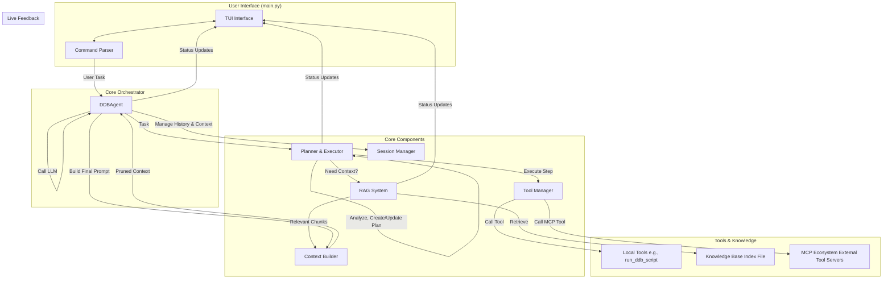

# ddb-agent: An Autonomous AI Coding Agent for DolphinDB

**ddb-agent** 是一款专为 [DolphinDB](https://www.dolphindb.cn/) 生态系统打造的、具备自主规划与工具使用能力的**自主 AI 编码代理**。它远超传统的 RAG 聊天机器人，是一个能够理解复杂任务、制定多步计划、执行代码、与外部工具交互、并从错误中自我修正的智能开发伙伴。

---

## 核心特性

-   **🧠 自主规划与执行 (Plan-and-Execute)**: 面对复杂任务，能自主生成详细的行动计划，并按计划调用工具、执行代码、分析结果，甚至在失败时进行重规划。
-   **📊 交互式数据分析模式 (`/sql`)**: 独创的 `PLAN` 和 `ACT` 双模式工作流，允许用户引导和修正 Agent 的数据分析过程。Agent 先提出计划，用户批准后再执行，实现了人机协同。
-   **💾 动态上下文注入 (`/use`)**: 在交互式分析中，用户可以动态地将数据库和表的 Schema 注入到当前任务的上下文中，使 Agent 能够实时感知和利用未知的数据环境。上下文与会话绑定，支持持久化。
-   **🔌 模型上下文协议 (MCP - Model Context Protocol)**: 创新的 **"工具即服务" (Tool-as-a-Service)** 架构。允许 Agent 动态地发现、安装和运行外部工具服务器，无限扩展其能力，例如与文件系统、Jira、Confluence 等进行交互。
-   **🚀 高级 RAG 流程**: 采用两阶段检索策略（并行 LLM 粗筛 + LLM 精排），从海量文档和代码中精准召回最相关的上下文，为决策提供依据。
-   **📚 智能上下文管理**: 独创的预算分配和剪枝策略。通过动态计算 Token 预算和使用 LLM 提取大文件中的关键代码片段，有效避免了上下文超长的问题。
-   **✨ 交互式 TUI 界面**: 基于 `Textual` 构建，提供了一个功能丰富、实时反馈的终端用户界面，清晰地展示 Agent 的每一步思考和行动。
-   **✂️ 代码片段管理**: 内置代码片段管理器，允许用户保存、搜索和复用常用的代码模板。

---

## 架构概览

`ddb-agent` 采用先进的模块化架构，以一个中央协调器（Agent）为核心，驱动多个专业组件协同工作。



---

## 安装与配置

请按照以下步骤来设置和运行本项目。

### 1. 克隆项目

```bash
git clone <your-repository-url>
cd ddb-agent
```

### 2. 创建并激活虚拟环境

建议使用虚拟环境以隔离项目依赖。

```bash
# For Unix/macOS
python3 -m venv venv
source venv/bin/activate

# For Windows
python -m venv venv
.\venv\Scripts\activate
```

### 3. 安装依赖

```bash
pip install -r requirements.txt
```

### 4. 配置模型和 API 密钥

配置分为两步：定义模型和设置凭据。

#### a) 定义模型 (`models.json`)

在项目根目录创建一个 `models.json` 文件。这里定义了你可以使用的不同 LLM 的别名和配置。

```json
[
  {
    "name": "deepseek-chat",
    "model_name": "deepseek-chat",
    "base_url": "https://api.deepseek.com/v1",
    "api_key_env_var": "DEEPSEEK_API_KEY",
    "description": "Default chat model from DeepSeek.",
    "log_requests": true
  },
  {
    "name": "openai-gpt4o",
    "model_name": "gpt-4o",
    "base_url": "https://api.openai.com/v1",
    "api_key_env_var": "OPENAI_API_KEY",
    "description": "OpenAI's GPT-4o model.",
    "log_requests": false
  }
]
```

#### b) 设置凭据 (`.env` 文件)

在项目根目录创建一个 `.env` 文件来安全地存放你的 API 密钥。**不要将此文件提交到 Git 仓库**。

```dotenv
# .env file
# Keys should match the "api_key_env_var" values in models.json
DEEPSEEK_API_KEY="sk-your-deepseek-api-key"
OPENAI_API_KEY="sk-your-openai-api-key"

# DolphinDB connection details for the CodeExecutor
DDB_HOST="localhost"
DDB_PORT="8848"
DDB_USER="admin"
DDB_PASSWORD="123456"
```

---

## 使用方法

### 步骤 1: 构建知识库索引

Agent 需要一个索引文件来了解你的项目。运行以下脚本来扫描指定目录（如 `documentation`）并生成知识库。

```bash
python build_index.py
```

**注意**: 这个步骤只需要在项目文档或代码发生显著变化时重新运行。

### 步骤 2: 启动代理

运行 `main.py` 启动交互式 TUI。

```bash
python main.py
```

### 执行模式

`ddb-agent` 提供多种执行模式以应对不同复杂度的任务：

1.  **直接提问 (聊天模式)**: 直接输入你的问题。Agent 会启动 RAG 流程，检索相关知识并回答。适用于问答场景。
2.  **`/sql <任务>` (交互式分析模式)**: **推荐用于所有数据查询和分析任务**。Agent 会进入 `PLAN`/`ACT` 模式，与你协作完成分析。
3.  **`/enhanced <任务>` (增强编码模式)**: 当你需要完成复杂的、涉及代码生成和多工具调用的任务时使用。Agent 会启动强大的“规划-执行”循环。
4.  **`/react <任务>` (动态推理模式)**: 使用经典的“思考-行动-观察”循环，适用于需要动态调整策略的任务。
5.  **`/spec <任务>` (需求工程模式)**: 当你需要对一个新功能进行严谨的设计时，使用此模式。Agent 会引导你完成需求分析、技术设计和任务分解。

### 可用命令

| 命令 | 描述 |
| --- | --- |
| **核心模式** | |
| `/chat <query>` | 明确启动 RAG 聊天查询。 |
| `/sql <task>` | **（推荐）** 启动交互式数据分析任务。 |
| `/mode <plan\|act>` | （在 `/sql` 模式下）手动切换 Agent 的工作模式。 |
| `/enhanced <task>` | 启动增强的“规划-执行”编码任务。 |
| `/react <task>` | 启动 ReAct 动态推理任务。 |
| `/spec <task>` | 进入结构化需求开发模式。 |
| **会话与上下文** | |
| `/session new` | 开始一个全新的对话会话 (`Ctrl+N`)。 |
| `/session switch <name>` | 切换到指定会话。 |
| `/session list` | 列出所有会话。 |
| `/use [path]` | （在 `/sql` 模式下）将数据库或表的 Schema 注入当前会话。 |
| `/context <show\|clear>` | （在 `/sql` 模式下）显示或清除当前会话注入的上下文。|
| **代码片段 (Snippets)** | |
| `/snippet new` | 创建一个新的代码片段。 |
| `/snippet list` | 列出所有已保存的片段。 |
| `/snippet edit <name>` | 编辑一个指定的片段。 |
| **MCP 工具协议** | |
| `/mcp market` | 打开 MCP 市场，浏览/安装工具服务器。 |
| `/mcp manager` | 打开已安装服务器的管理界面。 |
| `/mcp start <name>` | 启动一个已安装的服务器。 |
| `/mcp stop <name>` | 停止一个正在运行的服务器。 |
| **通用** | |
| `/help` | 显示此帮助信息。 |
| `/exit` 或 `/quit` | 退出代理程序 (`Ctrl+Q`)。 |

---

## 未来路线图

`ddb-agent` 的架构为未来的功能扩展提供了坚实的基础。

-   [ ] **数据可视化集成**: 在 `/sql` 模式下，Agent 能够分析查询结果并主动建议、生成图表代码（如 ECharts, Matplotlib）。
-   [ ] **长期记忆与项目状态感知**: 引入向量数据库，赋予 Agent 跨会话的长期记忆，并能感知整个项目的宏观状态。
-   [ ] **更智能的工具发现与组合**: 让 Agent 能根据任务上下文，更智能地选择和组合工具，甚至动态生成新的工具调用序列。
-   [ ] **多 Agent 协作**: 探索让多个专有 Agent（如一个“DBA Agent”和一个“数据分析 Agent”）协同工作的可能性。
-   [ ] **性能优化**: 优化 LLM 调用链，减少不必要的 Token 开销和等待时间。

---

